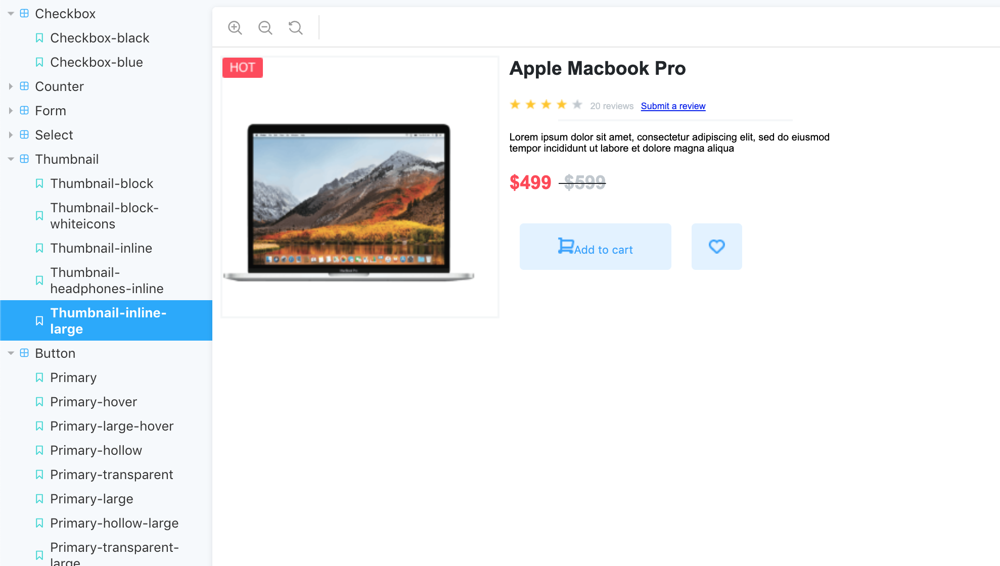

## React Component Library

The goal for this project was to build a set of reusable components with a cohesive theme. All of this components were designed according to an adobeXd prototype. 
 

### Technology Used
* HTML
* CSS
* Javascript
* Storybook
* AdobeXd

This component library was published to NPM and is available for download at (https://www.npmjs.com/package/react-component-by-karen)

Github: (https://github.com/karenheyn/react-component-library)
